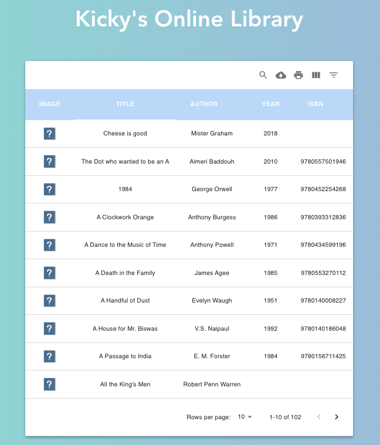

<div id="top"></div>
<!-- PROJECT LOGO -->
<br />
<div align="center">
<h1 align="center">Kicky's Online Library</h1>
</div>


<!-- TABLE OF CONTENTS -->
<details>
  <summary>Table of Contents</summary>
  <ol>
    <li>
      <a href="#about-the-project">About The Project</a>
    </li>
    <li><a href="#build-with">Built With</a></li>
    <li><a href="#getting-started">Getting Started</a></li>
    <li><a href="#contact">Contact</a></li>
  </ol>
</details>


<!-- ABOUT THE PROJECT -->
## About The Project

Kicky's Online Library is a responsive datatable component built on a third-party React package called Material-UI. Along with Javascript and Vite. The book list is able to provide more than 100 books' information from Amazon by applying "search", "sort", "filter" ,"download", "print" and more features.


  


<p align="right">(<a href="#top">back to top</a>)</p>


<!-- BUILT WITH -->
## Built With

* [Javascript](https://www.javascript.com)
* [Vite](https://vitejs.dev)
* [React](https://reactjs.org/)
* [CSS](https://developer.mozilla.org/en-US/docs/Web/CSS)


<p align="right">(<a href="#top">back to top</a>)</p>


## Getting started
1. Clone this repository (only this branch)

   ```bash
   git clone https://github.com/kickylau/ServicePros-Coding-Challenge.git
   ```

2. Install dependencies


    ```shell
    yarn
    ```
<!--
    ```
    yarn add mui-datatables --save
    ``` -->

    If your project doesn't already use them, you need to install mui v5 and it's icon pack:
    ```yarn --save add @mui/material @emotion/react @emotion/styled @mui/icons-material
    ```


3. Start the server locally

    ```shell
    yarn run dev
    ```

    Open `http://localhost:5173` in a browser.


<!-- CONTACT -->
## Contact


Kicky Liu - [GitHub](https://github.com/kickylau)

Project Repo Link: [https://github.com/kickylau/ServicePros-Coding-Challenge.git](https://github.com/kickylau/ServicePros-Coding-Challenge.git)


<p align="right">(<a href="#top">back to top</a>)</p>
